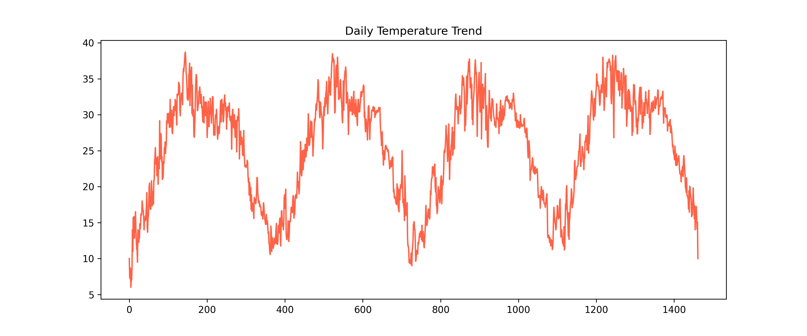
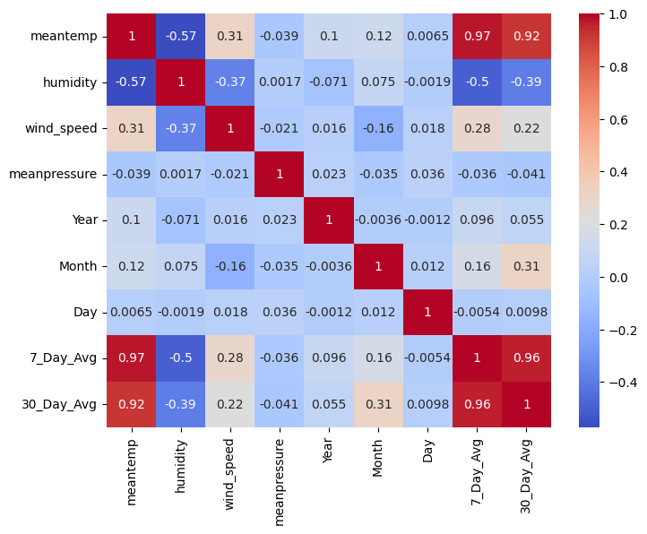
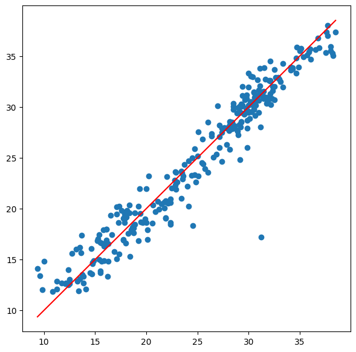

# 🌦️ Weather Data Analysis and Temperature Prediction

A Machine Learning project that analyzes historical weather data and predicts daily mean temperature using regression models. The project includes data preprocessing, exploratory data analysis (EDA), feature engineering, model comparison, and visualization of weather trends.

---

## 📌 Project Overview

This project uses historical weather data from Delhi to analyze climate patterns and build predictive models for forecasting daily mean temperature.

The workflow includes:

- Data Cleaning & Preprocessing
- Exploratory Data Analysis (EDA)
- Feature Engineering
- Regression Model Training
- Model Evaluation
- Temperature Prediction
- Model Serialization using Joblib

---

## 📂 Dataset

Dataset: **Daily Delhi Climate Data**

Features include:

- Mean Temperature
- Humidity
- Wind Speed
- Mean Pressure
- Date

Additional features created:

- Year
- Month
- Day

---

## 🚀 Features

- 📊 Data Cleaning and Preprocessing
- 📈 Exploratory Data Analysis (EDA)
- 📅 Monthly Temperature Analysis
- 📉 Correlation Heatmap
- 📊 Rolling Average Trend Analysis
- 🤖 Linear Regression Model
- 🌲 Random Forest Regression Model
- 📋 Model Performance Comparison
- ⭐ Feature Importance Visualization
- 💾 Model Saving using Joblib
- 🌡️ Temperature Prediction on New Data

---

## 🛠️ Tech Stack

- Python
- Pandas
- NumPy
- Matplotlib
- Seaborn
- Scikit-learn
- Joblib
- Google Colab

---

## 📁 Project Structure

```
Weather-Data-Analysis-Prediction/
│
├── data/
│   └── DailyDelhiClimateTrain.csv
│
├── notebook/
│   └── Weather_Analysis.ipynb
│
├── models/
│   └── weather_prediction.pkl
│
├── images/
│   ├── temperature_trend.png
│   ├── correlation_heatmap.png
│   └── prediction_results.png
│
├── requirements.txt
├── .gitignore
└── README.md
```

---

## 📊 Exploratory Data Analysis

The notebook includes:

- Temperature Trend Analysis
- Humidity Distribution
- Wind Speed Distribution
- Mean Pressure Distribution
- Correlation Heatmap
- Monthly Temperature Analysis
- Rolling Average Visualization

---

## 🤖 Machine Learning Models

The following regression models were trained and compared:

- Linear Regression
- Random Forest Regressor

---

## 📈 Model Performance

| Model | MAE | RMSE | R² Score |
|------|------|------|---------|
| Linear Regression | 4.98 | 6.07 | 0.315 |
| Random Forest | **1.27** | **1.78** | **0.941** |

Random Forest achieved the best performance with an **R² Score of approximately 94%**, making it the preferred model for temperature prediction.

---

## 📷 Results

### 🌡️ Temperature Trend

Shows how the daily mean temperature changes over time.



---

### 🔥 Correlation Heatmap

Illustrates the correlation between weather attributes such as temperature, humidity, wind speed, pressure, and engineered date features.



---

### 🤖 Actual vs Predicted Temperature

Comparison of the Random Forest model's predictions against the actual observed temperatures.


---

## ▶️ Installation

Clone the repository

```bash
git clone https://github.com/yourusername/Weather-Data-Analysis-Prediction.git
```

Install dependencies

```bash
pip install -r requirements.txt
```

Run the notebook using Jupyter Notebook or Google Colab.

---

## 👨‍💻 Author

**Vaishnavi Waghmare**

If you found this project useful, consider giving it a ⭐ on GitHub.
